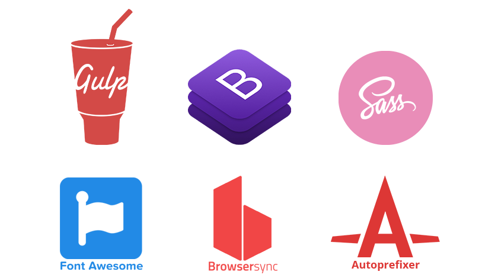

# Bootstrap-Sass-FontAwesome Gulp Boilerplate

### A simple boilerplate for front-end projects.
</br>



## Includes
- gulp 4.0.2
- gulp-cli 2.3.0
- gulp-sass 4.1.0
- gulp-autoprefixer 7.0.1
- browsersync 2.26.13
- del 6.0.0
- merge-stream 2.0.0
- bootstrap 4.5.3
- jquery 3.5.1
- popper.js 1.16.1
- fontawesome 5.15.1

## Requirements
- [Node](https://nodejs.org/en/download/)

## Install

```
git clone https://github.com/LGA-dev/bootstrap-sass-fontawesome-gulp-boilerplate.git
cd bootstrap-sass-fontawesome-gulp-boilerplate
npm install
npm start
```

## Usage

### There are 2 commands for this boilerplate:

```
gulp
```

>This command will delete the vendor folder, then it will create an empty vendor folder and copy all the third party resources into it. 

>Running ```gulp``` is the same as running ```npm start```.

```
gulp watch
```

>This command will create a local server and automatically reload the browser if any html/scss/js file changes.

>If a change is detected on a scss file, then all scss files will get compiled into a single minified css file.
